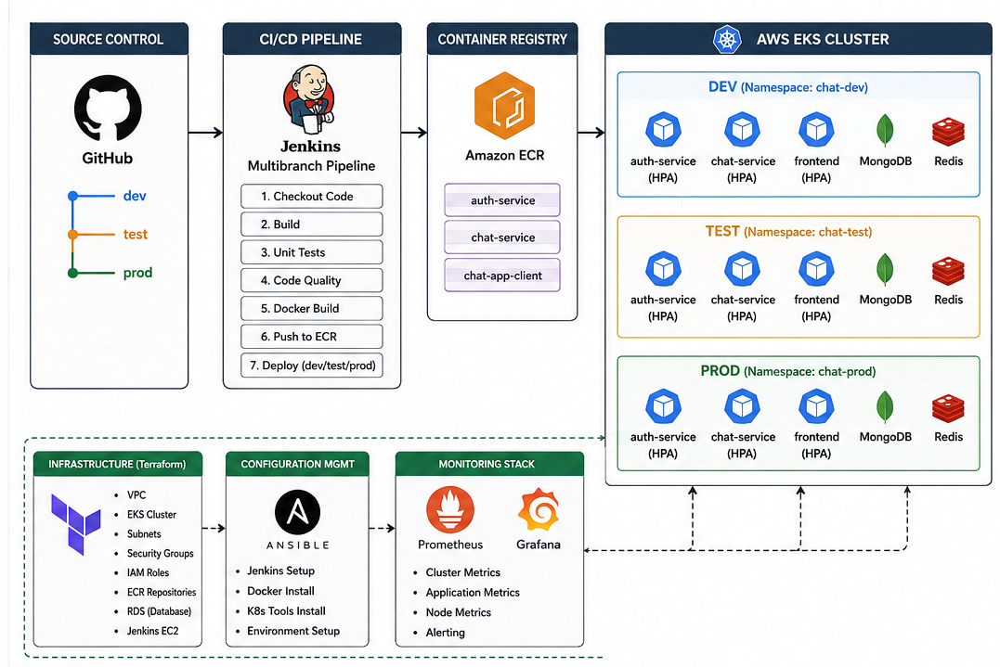

# Capstone Project: Complete DevOps Pipeline

## Project Overview

This project implements a complete cloud-native DevOps platform for a microservices-based chat application using AWS and modern DevOps tools.

The solution demonstrates:

* Infrastructure as Code (Terraform)
* CI/CD Automation (Jenkins)
* Containerization (Docker)
* Kubernetes Orchestration (Amazon EKS)
* Application Packaging (Helm)
* Monitoring & Alerting (Prometheus + Grafana)
* Environment Promotion (Dev → Test → Prod)
* Cloud-Native Deployment Practices

---

# Technology Stack

| Category                 | Tools                        |
| ------------------------ | ---------------------------- |
| Source Control           | GitHub                       |
| CI/CD                    | Jenkins Multibranch Pipeline |
| Containerization         | Docker                       |
| Container Registry       | Amazon ECR                   |
| Orchestration            | Amazon EKS                   |
| Package Management       | Helm                         |
| Infrastructure as Code   | Terraform                    |
| Configuration Management | Ansible                      |
| Monitoring               | Prometheus + Grafana         |
| Database                 | MongoDB                      |
| Cache                    | Redis                        |
| Cloud Provider           | AWS                          |

---

# Application Architecture

### Microservices

* Frontend Service (React/Vite)
* Auth Service (Spring Boot)
* Chat Service (Spring Boot)

### Supporting Services

* MongoDB
* Redis

## Application Architecture Diagram


```markdown
## Architecture Diagram

```

### AWS Infrastructure

* VPC
* Public Subnets
* Private Subnets
* EKS Cluster
* ECR Repositories
* RDS Database
* Jenkins EC2 Instance
* Security Groups
* IAM Roles & Policies

---

# Repository Structure

```text
Capstone_Project/
│
├── app/
│   ├── auth-service/
│   ├── chat-service/
│   └── chat-app-client/
│
├── helm/
│   └── chat-app/
│
├── terraform/
│   ├── dev/
│   ├── test/
│   ├── prod/
│   └── modules/
│
├── ansible/
│
├── kubernetes/
│
├── Jenkinsfile
│
└── README.md
```

---

# Branching Strategy

The project follows a multi-environment branching model:

| Branch | Environment     |
| ------ | --------------- |
| dev    | Development     |
| test   | Testing/Staging |
| prod   | Production      |

### Promotion Flow

```text
dev
 ↓
test
 ↓
prod
```

Code is promoted through Pull Requests and validated by Jenkins before deployment.

---

# CI/CD Pipeline

Implemented using Jenkins Multibranch Pipeline.

## Development Branch

Pipeline Flow:

```text
Git Push
 ↓
Build Backend
 ↓
Build Frontend
 ↓
Docker Build
 ↓
Push Images to ECR
```

## Test Branch

Pipeline Flow:

```text
Git Push
 ↓
Build
 ↓
Docker Build
 ↓
Push to ECR
 ↓
Deploy to EKS (chat-test)
```

## Production Branch

Pipeline Flow:

```text
Git Push
 ↓
Build
 ↓
Docker Build
 ↓
Push to ECR
 ↓
Manual Approval
 ↓
Deploy to EKS (chat-prod)
```

---

# Docker & Amazon ECR

Each microservice has its own Docker image.

Repositories:

* auth-service
* chat-service
* chat-app-client

Images are automatically pushed to Amazon ECR through Jenkins.

---

# Kubernetes Deployment

Application deployed on Amazon EKS.

Namespaces:

```bash
chat-dev
chat-test
chat-prod
```

Resources deployed:

* Deployments
* Services
* ConfigMaps
* Secrets
* Persistent Volume Claims
* Horizontal Pod Autoscalers

---

# Helm Charts

Application is packaged using Helm.

Environment-specific values:

```text
values-dev.yaml
values-test.yaml
values-prod.yaml
```

Deployment command:

```bash
helm upgrade --install chat-app helm/chat-app
```

---

# Infrastructure as Code (Terraform)

Terraform modules were created for:

## VPC Module

* Public Subnets
* Private Subnets
* Route Tables
* Internet Gateway

## EKS Module

* Cluster
* Node Groups
* IAM Roles

## ECR Module

* Container Registries

## RDS Module

* Managed Database

## Jenkins Module

* Jenkins EC2 Instance

---

# Environment Separation

Separate environments are maintained:

## Development

Namespace:

```bash
chat-dev
```

## Testing

Namespace:

```bash
chat-test
```

## Production

Namespace:

```bash
chat-prod
```

This ensures complete isolation between environments.

---

# Configuration Management

Ansible playbooks automate:

* Jenkins setup
* Docker installation
* AWS CLI installation
* Kubernetes tools installation
* Environment provisioning

---

# Monitoring & Alerting

Implemented using:

* Prometheus
* Grafana
* kube-prometheus-stack

Monitored Metrics:

### Cluster Metrics

* CPU Usage
* Memory Usage
* Node Health

### Application Metrics

* Pod Status
* Replica Count
* Resource Utilization

### HPA Metrics

* CPU-based Autoscaling
* Pod Scaling Events

---

# Horizontal Pod Autoscaling (HPA)

Configured for:

* Auth Service
* Chat Service
* Frontend Service

Configuration:

```text
Minimum Pods: 2
Maximum Pods: 5
CPU Threshold: 70%
```

---

# Deployment Verification

```bash
kubectl get pods -A

kubectl get hpa -A

kubectl top pods -A

kubectl top nodes
```

---

# Monitoring Verification

```bash
kubectl get pods -n monitoring

helm list -A
```

Grafana dashboards display:

* Node Metrics
* Kubernetes Cluster Metrics
* Pod Resource Usage
* Autoscaling Metrics

---

# Troubleshooting

### Check Pods

```bash
kubectl get pods -A
```

### Check HPA

```bash
kubectl get hpa -A
```

### Check Logs

```bash
kubectl logs <pod-name>
```

### Check Helm Releases

```bash
helm list -A
```

---

# Project Deliverables

✔ GitHub Repository

✔ Jenkins Multibranch Pipeline

✔ Dockerfiles

✔ Amazon ECR Integration

✔ Amazon EKS Deployment

✔ Helm Charts

✔ Terraform Modules

✔ Ansible Playbooks

✔ Prometheus Monitoring

✔ Grafana Dashboards

✔ Horizontal Pod Autoscaling

✔ Dev / Test / Prod Environments

✔ End-to-End Automated CI/CD Pipeline

---

# Demo Video Flow

1. Show GitHub Repository
2. Show Branches (dev/test/prod)
3. Commit Code to dev
4. Jenkins Pipeline Trigger
5. Docker Image Build
6. Push to Amazon ECR
7. Merge dev → test
8. Automatic Deployment to EKS
9. Show Pods Running
10. Show Grafana Dashboard
11. Show HPA Metrics
12. Merge test → prod
13. Production Approval
14. Production Deployment
15. Final Application Demonstration

```
```
